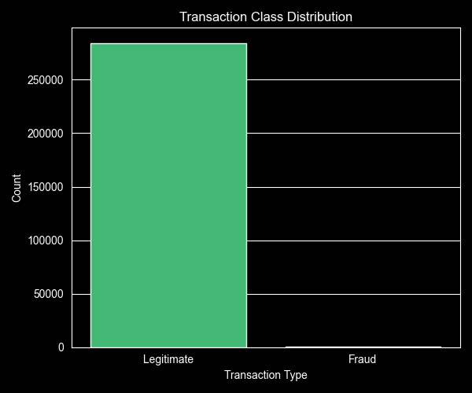
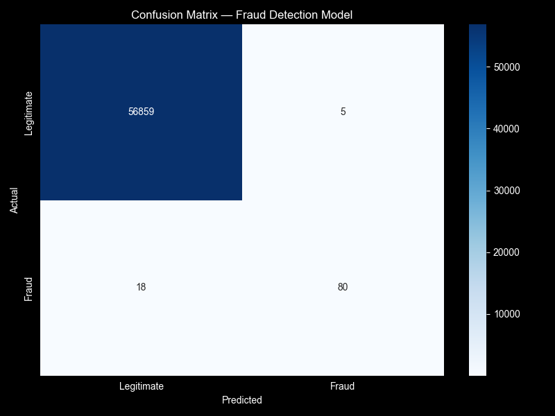
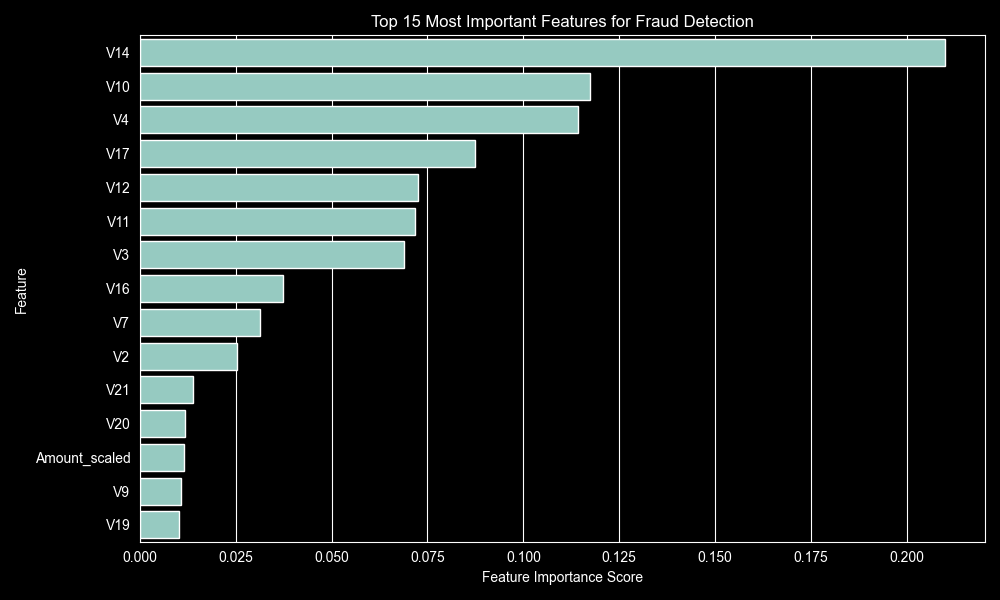
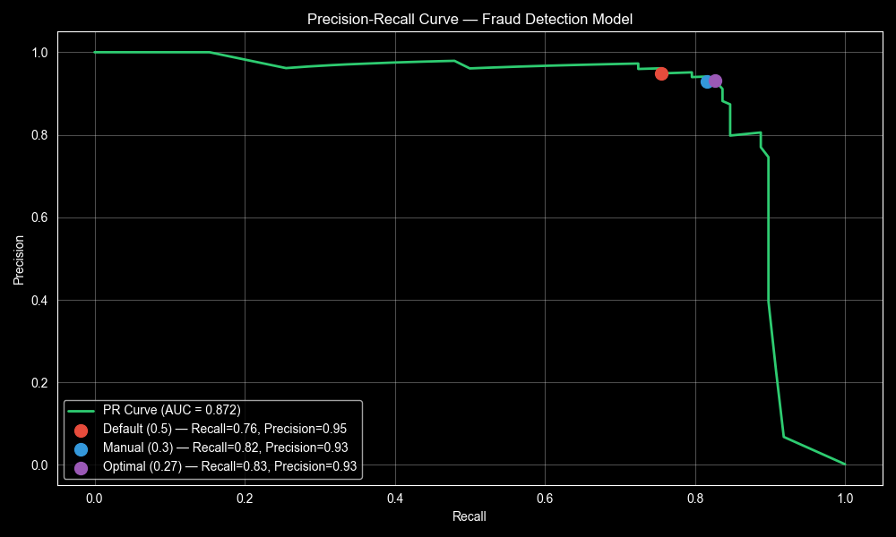

# Credit Card Fraud Detection

This project uses machine learning to detect fraudulent credit card transactions.

The dataset comes from Kaggle and contains 284,807 real transactions. Only 492 of them are fraud cases, which is about 0.17% of the data. Because of this, accuracy is not a useful metric. A model could predict every transaction as normal and still get very high accuracy, while detecting no fraud at all.

For this reason, I focused more on precision, recall, and F1 score.

## What I built

I trained a Random Forest model to classify transactions as either normal or fraudulent.

To deal with the class imbalance, I used:

* `class_weight='balanced'` so the model gives more importance to fraud cases
* threshold tuning to improve fraud detection
* a simple threshold search that tests values from 0.1 to 0.9 and chooses the best one based on F1 score

The default threshold of 0.5 worked well, but lowering it helped catch more fraud cases without adding many false positives.

## Results

| Threshold | Fraud caught | Missed fraud | False positives | F1 Score |
| --------- | ------------ | ------------ | --------------- | -------- |
| 0.50      | 74/98        | 24           | 3               | 0.85     |
| 0.30      | 80/98        | 18           | 5               | 0.87     |
| 0.27      | 81/98        | 17           | 6               | 0.88     |

The best threshold was 0.27. It caught 81 out of 98 fraud cases and only flagged 6 normal transactions incorrectly out of 56,864 normal transactions.

## Main findings

* Lowering the threshold improved recall from 76% to 83%.
* The model caught 7 more fraud cases compared to the default threshold.
* The number of false positives only increased from 3 to 6.
* V14 and V10 were the most important features.
* The model missed more high-value fraud transactions compared to lower-value ones.

## How to run

1. Download the dataset from Kaggle:

   [Credit Card Fraud Detection Dataset](https://www.kaggle.com/datasets/mlg-ulb/creditcardfraud)

2. Put `creditcard.csv` inside a `data/` folder.

3. Install the requirements and run the script:

```bash
pip install -r requirements.txt
python fraud_detection.py
```

## Tech stack

* Python
* pandas
* NumPy
* scikit-learn
* matplotlib
* seaborn

## Visualizations









## Dataset

Dataset: [Kaggle Credit Card Fraud Detection](https://www.kaggle.com/datasets/mlg-ulb/creditcardfraud)

The dataset was provided by the Machine Learning Group - ULB.
